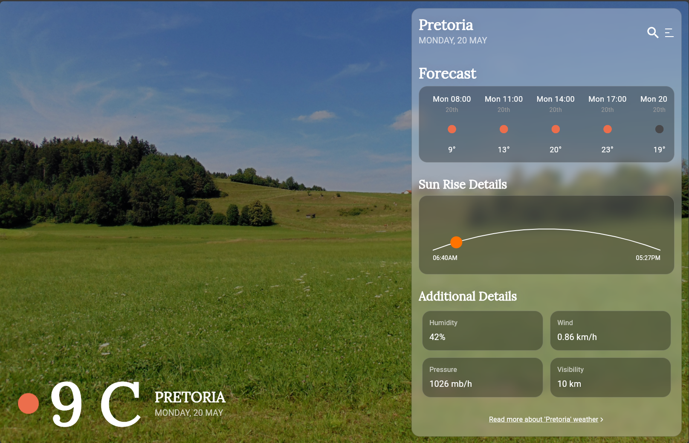
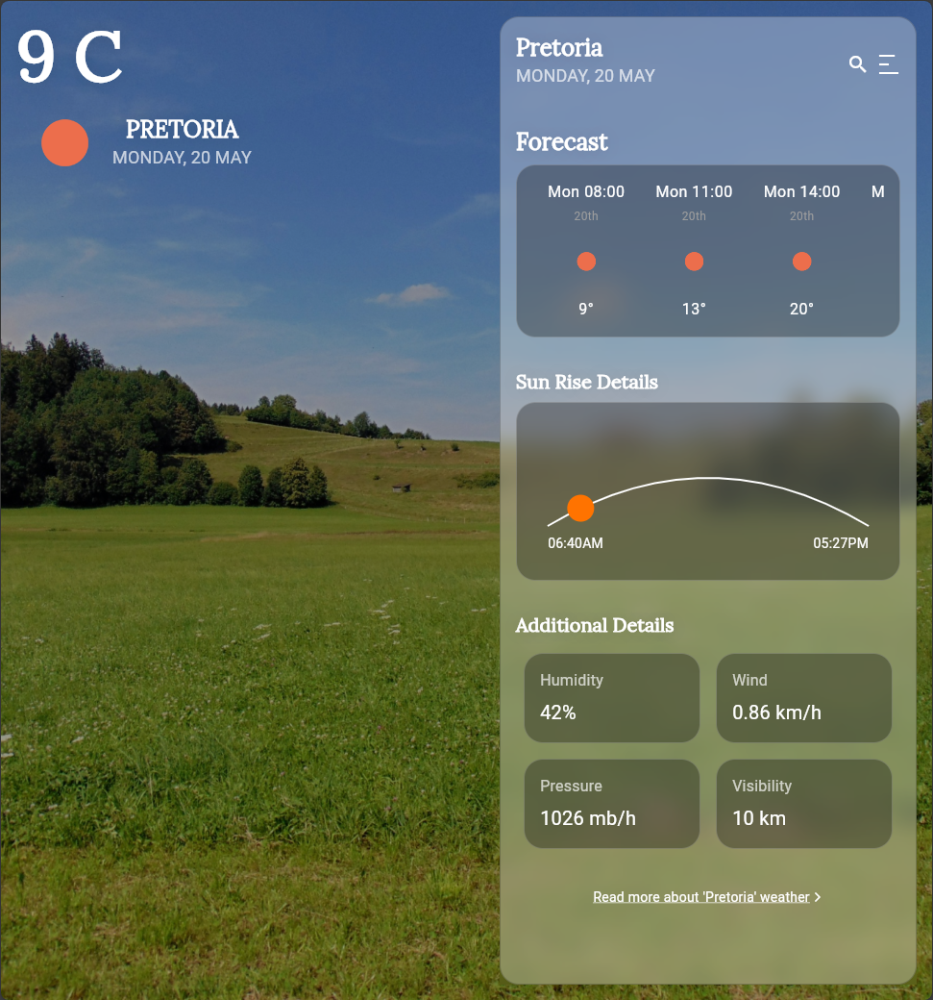
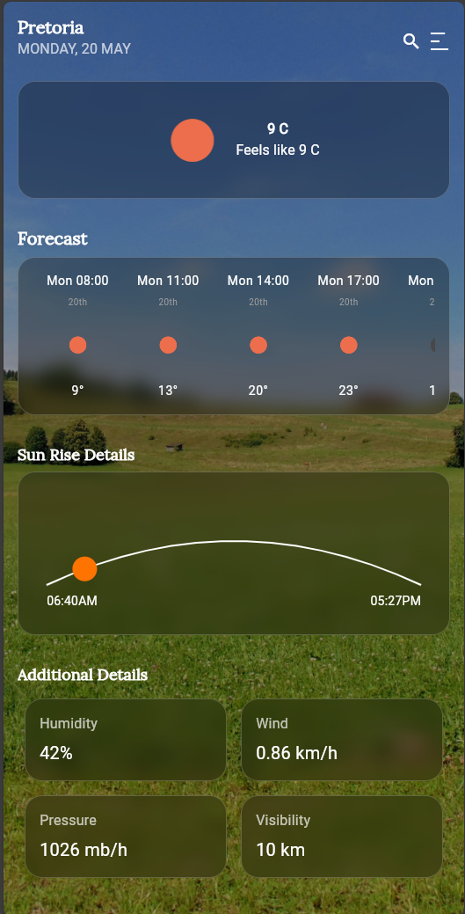

<!-- @format -->

# Weather Application README

This document provides an overview of the codebase for a Flutter weather application. It explains the purpose and functionality of each section and file, detailing how the various components interact to form the complete application.

## Screenshots

### Desktop View



### Tablet View



### Mobile View



## Versions and Tools Used

- **Flutter**: 3.19.6
- **Dart**: 2.19.6
- **Provider**: 6.0.5

  To set up the project, ensure that the versions of Flutter and Dart are as mentioned above. You can manage Flutter versions using FVM (Flutter Version Management).

## Project Structure

```folder structure
lib
└── src
├── api
│ ├── api.dart
│ ├── api_keys.dart
├── constants
│ └── app_colors.dart
├── features
│ ├── models
│ │ ├── forecast_data.dart
│ │ └── weather_data.dart
│ └── weather
│ ├── application
│ │ ├── layout_provider.dart
│ │ └── providers.dart
│ ├── data
│ │ ├── api_exception.dart
│ │ └── weather_repository.dart
│ ├── enums
│ │ ├── forecast_enum.dart
│ │ └── unit_enums.dart
│ ├── presentation
│ │ └── views
│ │ ├── weather_desktop.dart
│ │ ├── weather_mobile.dart
│ │ ├── weather_tablet.dart
│ │ └── weather_page.dart
│ └── widgets
├── utils
│ ├── date_utils.dart
│ └── formatting_utils.dart
└── main.dart
```

## Explanation of Sections and Files

### `lib/src/api`

- **api.dart**: Contains the `OpenWeatherMapAPI` class which constructs URIs for API requests to the OpenWeatherMap service. It dynamically builds URIs based on the provided city name and other parameters.

```dart
import 'package:weather_wise/src/api/api_keys.dart';
import 'package:provider/provider.dart';

class OpenWeatherMapAPI {
  // ...
}
```

- **api_keys.dart**: Stores the API key for accessing the OpenWeatherMap service. This file uses the GetIt package for dependency injection.

```dart

  import 'package:get_it/get_it.dart';

  final sl = GetIt.instance;

  void setupInjection() {
    // Register the API key
  }
```

### `lib/src/constants`

- **app_colors.dart**: Defines text styles with different sizes and shadows for mobile, tablet, and web using the GoogleFonts package. It provides a consistent look and feel across different devices.

### `lib/src/features/models`

- **forecast_data.dart**: Contains data models for the forecast data fetched from the OpenWeatherMap API using the freezed package for immutable data classes. It defines the structure of the data received from the API.

```dart
import 'package:freezed_annotation/freezed_annotation.dart';

part 'forecast_data.freezed.dart';
part 'forecast_data.g.dart';

@freezed
class ForecastData with _$ForecastData {
  // ...
}
```

### `lib/src/features/weather/application`

- **layout_provider.dart**: Manages the layout (mobile, tablet, desktop) and notifies listeners of changes. It determines the appropriate UI layout based on the device type.

```dart
import 'package:flutter/material.dart';

enum DeviceType { mobile, tablet, desktop }

class LayoutProvider extends ChangeNotifier {
  // ...
}
```

### `lib/src/features/weather/data`

- **api_exception.dart**: Defines custom exceptions for API errors. These exceptions handle specific error cases such as invalid API key, no internet connection, and city not found.

```dart
class APIException implements Exception {
  // ...
}

class InvalidApiKeyException extends APIException {
  // ...
}

// Other exceptions...
```

- **weather_repository.dart**: Contains the HttpWeatherRepository class which handles API requests and data parsing. It interacts with the OpenWeatherMapAPI to fetch data from the API.

### `lib/src/features/weather/enums`

- **forecast_enum.dart**: Defines the ForecastRange enum for daily and three-hourly forecast options. It helps in selecting the type of forecast to display.

```dart
enum ForecastRange { daily, threeHourly }
```

- **unit_enums.dart**: Defines the Unit enum for metric and imperial units. It provides a way to switch between measurement units.

```dart
enum Unit { metric, imperial }
```

### `lib/src/features/weather/presentation/views`

- **weather_desktop.dart, weather_mobile.dart, weather_tablet.dart**: UI components for different device types. These files contain the widgets and layouts specific to each device type, ensuring a responsive design.

```dart
import 'package:flutter/material.dart';
// weather_desktop.dart
class WeatherDesktop extends StatelessWidget {
  // ...
}
// weather_mobile.dart
class WeatherMobile extends StatelessWidget {
  // ...
}
// weather_tablet.dart
class WeatherTablet extends StatelessWidget {
  // ...
}
```

- **weather_page.dart**: Main weather page component that adapts to different device types. It combines the different UI components into a single page and manages the overall layout.
